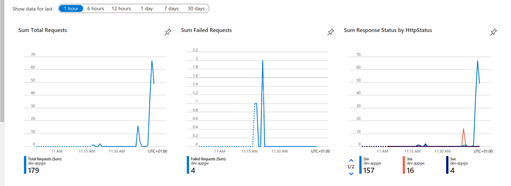

<h1 align="center">
  <br>

  <br>
  Application Gateway Ingress Controller
  
  <br>
</h1>


Here we will together deploy an Application Gateway Ingress Controller along with an existing AKS cluster via Azure CLI. <br>


# Step by step

```
# Export your variables
export rgName=
export aksName=
export pipName=
export appgwVnetName=
export location=
export appgwName=
export wafPolicyName=
export aksVnetName=
export peeringName=

```

```
# Create public ip
az network public-ip create -n $pipName -g $rgName -l $location --allocation-method Static --sku Standard
```

```
# Create vnet
az network vnet create -n $appgwVnetName -g $rgName -l $location --address-prefix 10.0.0.0/16 --subnet-name $snetName --subnet-prefix 10.0.0.0/24 
```

```
# Create WAF policy
az network application-gateway waf-policy create --name $wafPolicyName --resource-group $rgName
```

```
# Create application gateway
az network application-gateway create -n $appgwName -l westeurope -g $rgName --sku WAF_v2 --public-ip-address $pipName --vnet-name $appgwVnetName --subnet $snetName --priority 100 --waf-policy $wafPolicyName
```


```
# Enable Application Gateway Ingress Controller on AKS
appgwId=$(az network application-gateway show -n $appgwName -g $rgName -o tsv --query "id") 
az aks enable-addons -n $aksName -g $rgName -a ingress-appgw --appgw-id $appgwId
```

```
# Create vnet peerings
aksVnetId=$(az network vnet show -n $aksVnetName -g $rgName -o tsv --query "id")
az network vnet peering create -n AppGWtoAKSVnetPeering -g $rgName --vnet-name $appgwVnetName --remote-vnet $aksVnetId --allow-vnet-access

appGWVnetId=$(az network vnet show -n $appgwVnetName -g $rgName -o tsv --query "id")
az network vnet peering create -n AKStoAppGWVnetPeering -g $rgName --vnet-name $aksVnetName --remote-vnet $appGWVnetId --allow-vnet-access
```

```
# Let's deploy a simple webserver application
git clone https://github.com/lopes221/aksAppGatewayIngressController.git
cd deployments
kubectl creane namespace nginx
kubectl apply -f nginx-deployment.yaml -n nginx
kubectl apply -f nginx-service.yaml -n nginx
kubectl apply -f nginx-ingress.yaml -n nginx
```

```
# Getting your Ingress IP
kubectl get ingress -n nginx
```


By this time you should be able to access your application via IP
http://your-ingress-ip-here/


Go now to your application insight overview, you should see your traffic now from App Gateway Ingress Controller




## Author

Anderson Soares Lopes

[](https://github.com/lopes221)
[](https://www.linkedin.com/in/andersonsoaresl/)
